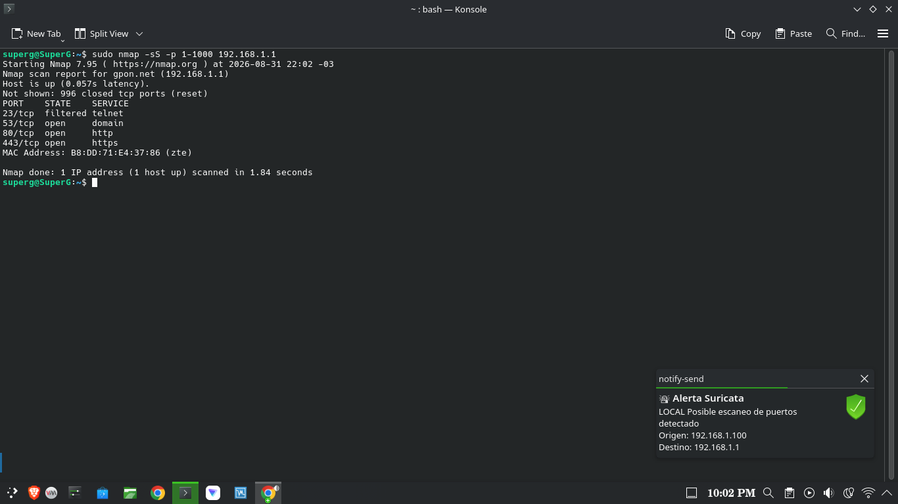

# Suricata IDS en Debian con alertas en el escritorio

Despliegue completo de Suricata 7.0.10 sobre Debian 13 (Trixie), desde la instalación hasta la notificación visual de alertas en tiempo real. Incluye la escritura de firmas propias, la corrección de dos fallos reales de configuración y la resolución del problema de permisos entre el servicio de sistema y la sesión gráfica.



## Qué hace

El sistema analiza el tráfico de red del equipo contra un conjunto de 52.659 firmas, y cuando algo coincide muestra una notificación en el escritorio con el nombre de la regla, el origen y el destino. Todo arranca solo: el motor con el sistema, el notificador con la sesión gráfica.

```
Interfaz de red
      |
      v
suricata.service  (root, systemd de sistema)  <-- 52.659 reglas
      |
      v
/var/log/suricata/eve.json   (permisos 644)
      |
      v
suricata-notify.service  (usuario, systemd --user)
      |
      v
notify-send  ->  KDE Plasma
```

La separación en dos servicios no es un detalle de implementación: Suricata corre como root y los procesos de root no tienen acceso al bus de sesión del entorno gráfico, así que una notificación emitida desde ahí se pierde sin generar error. El registro de eventos en disco actúa como punto de contacto entre ambos contextos.

## Entorno

| Componente | Versión |
|---|---|
| Sistema operativo | Debian 13.6 (Trixie) |
| Escritorio | KDE Plasma sobre Wayland |
| Suricata | 7.0.10 |
| Conjunto de reglas | Emerging Threats Open |
| Interfaz de captura | Adaptador inalámbrico USB, modo administrado |

## Alcance

Con una única interfaz de red en modo administrado, Suricata inspecciona el tráfico que entra y sale del propio equipo, no el del resto de la red. Es detección a nivel de host mediante un motor de red. Extender la cobertura al segmento completo requeriría un puerto espejo en el switch, ubicar el equipo como pasarela, o pasar la interfaz a modo monitor.

Un segundo límite es el cifrado: durante las pruebas la mayoría de los eventos capturados correspondieron a QUIC (HTTP/3 sobre UDP), donde el motor ve el flujo y sus metadatos pero no el contenido.

## Firmas propias

**Detección por contenido** — busca una cadena dentro de la URI de las peticiones HTTP.

```
alert http any any -> any any (msg:"LOCAL Prueba IDS - patron de test detectado"; http.uri; content:"SURICATA-TEST-GONZA"; sid:1000001; rev:1;)
```

**Detección por patrón de comportamiento** — identifica escaneos de puertos mediante un umbral temporal.

```
alert tcp any any -> $HOME_NET any (msg:"LOCAL Posible escaneo de puertos detectado"; flags:S; threshold:type both, track by_src, count 30, seconds 10; sid:1000002; rev:1;)
```

La segunda es la más interesante de las dos. `flags:S` restringe la coincidencia a paquetes SYN puros, que es la firma característica del escaneo de media apertura, y la cláusula `threshold` exige treinta ocurrencias del mismo origen en diez segundos antes de emitir un evento. El parámetro `type both` limita además la emisión a una alerta por ventana: sin eso, un escaneo de mil puertos generaría mil notificaciones y dejaría el escritorio inutilizable.

## Problemas encontrados

**El servicio no arrancaba y systemd no decía por qué.** Suricata arranca en modo demonio y desacopla su salida del proceso padre, así que el motivo del fallo queda en `/var/log/suricata/suricata.log` y no en el diario del sistema. Ahí aparecían dos problemas: la interfaz por defecto `eth0` no existe en este equipo, y ningún archivo de reglas coincidía con el patrón esperado. El segundo es el peligroso, porque un motor sin firmas arranca bien y se reporta activo sin detectar nada.

**Una firma que no compilaba por el orden de sus elementos.** Escrita como `content:"..."; http.uri;`, siguiendo la sintaxis heredada de Snort, el analizador la rechazaba. Suricata 7 usa buffers *sticky*: la declaración del buffer no modifica lo que la precede, sino que establece el contexto de inspección para todo lo que viene después. El orden correcto es `http.uri; content:"...";`.

**Un escaneo con nmap que no disparaba ninguna alerta.** Origen y destino pertenecían ambos al segmento protegido, mientras que las firmas de reconocimiento de Emerging Threats están redactadas desde la red externa hacia la interna. Es el mismo concepto de `HOME_NET` visto en la práctica: una definición demasiado amplia produce un sistema aparentemente sano que no detecta nada.

## Archivos del proyecto

```
suricata-ids-debian/
├── docs/
│   ├── Informe-Suricata-IDS-Debian.docx    Informe completo con capturas
│   └── img/                                 16 capturas del despliegue
├── rules/
│   └── local.rules                          Firmas propias
├── scripts/
│   └── suricata-notify.sh                   Vigilancia del registro y notificación
└── systemd/
    └── suricata-notify.service              Unidad de usuario
```

## Instalación

```bash
sudo apt install suricata jq libnotify-bin -y
sudo suricata-update
```

Editar `/etc/suricata/suricata.yaml` con el segmento de red y la interfaz reales:

```yaml
vars:
  address-groups:
    HOME_NET: "[192.168.1.0/24]"

af-packet:
  - interface: <tu-interfaz>

rule-files:
  - suricata.rules
  - local.rules
```

Copiar las firmas, el script y la unidad de usuario:

```bash
sudo cp rules/local.rules /var/lib/suricata/rules/
cp scripts/suricata-notify.sh ~/scripts/ && chmod +x ~/scripts/suricata-notify.sh
cp systemd/suricata-notify.service ~/.config/systemd/user/
```

Validar antes de arrancar, siempre:

```bash
sudo suricata -T -c /etc/suricata/suricata.yaml -v
sudo systemctl restart suricata
systemctl --user daemon-reload
systemctl --user enable --now suricata-notify.service
```

## Mantenimiento

```bash
sudo suricata-update && sudo systemctl restart suricata   # actualizar firmas
sudo suricata -T -c /etc/suricata/suricata.yaml -v        # validar cambios
systemctl --user status suricata-notify.service           # estado del notificador
```

## Trabajo posterior

El `eve.json` es el punto natural de extensión. Reenviarlo a una plataforma de gestión de eventos permitiría correlacionar las detecciones con registros de otras fuentes y conservar historial consultable. Sobre esa base también resultan posibles reglas de respuesta activa y ampliar la captura a la interfaz virtual del hipervisor, para inspeccionar el tráfico de las máquinas virtuales del equipo.

## Documentación

El informe completo, con las 16 capturas y el detalle de cada paso, está en [`docs/Informe-Suricata-IDS-Debian.docx`](docs/Informe-Suricata-IDS-Debian.docx).

## Advertencia

Las pruebas con nmap incluidas en este trabajo se realizaron exclusivamente sobre infraestructura propia. El escaneo de sistemas ajenos sin autorización expresa constituye una conducta tipificada por la normativa sobre delitos informáticos.

---

**Gonzalo Daniel Rodríguez de Mello** — Analista en Sistemas, Especialista en Ciberseguridad
[LinkedIn](https://linkedin.com/in/gonzardem) · Rivera, Uruguay
